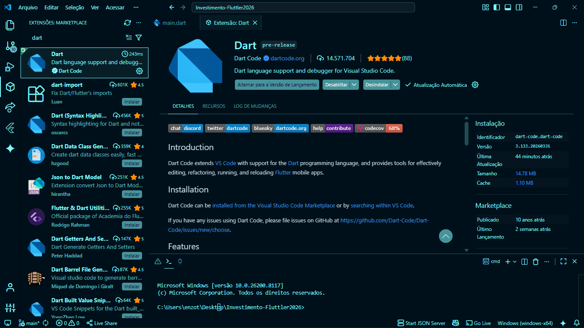
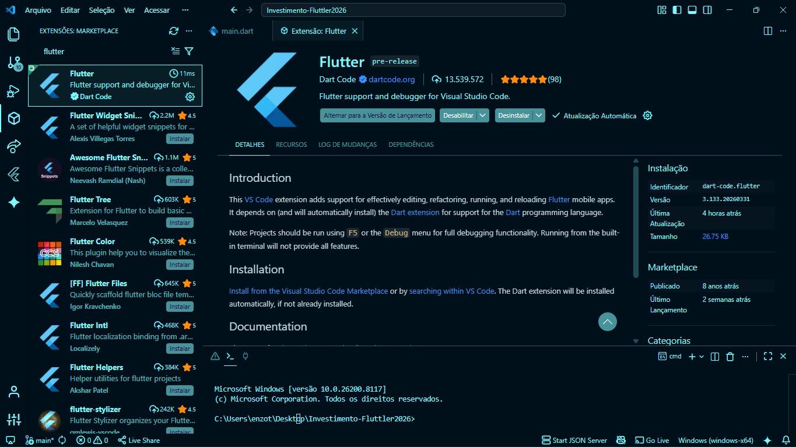
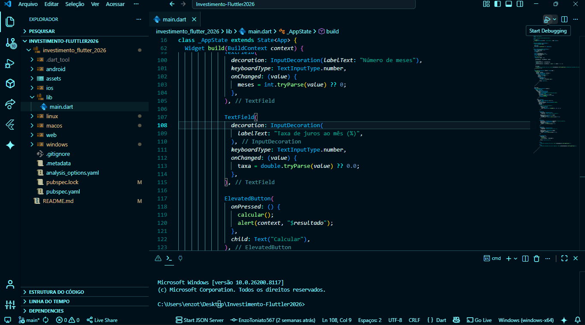

# Investiment Flutter: Apresentação do app

Aplicativo Flutter de simulação de investimento, desenvolvido para calcular o montante acumulado com base em aportes mensais, tempo de aplicação e taxa de juros ao mês.

# Objetivo

Simular um investimento de forma simples, ajudando a visualizar o valor acumulado ao longo do tempo com e sem a aplicação de juros compostos.

## Protótipo Figma

[Acessar Protótipo no Figma](https://www.figma.com/proto/0GPZjW3qLxCgxngdx5cZxs/Investimento-Flutter?node-id=0-1&t=FQTfUzawfEMcpE9m-1)

## Como executar o projeto (Passo a Passo)

- (Clone este repositório primeiro)

<p align="center">
  <em>1. Instalar a extensão Dart</em><br><br>
  <br>
  <em>2. Instalar a extensão Flutter</em><br><br>
  <br>
  <em>3. Abrir a pasta lib em main.dart</em><br><br>
  <br>
  <em>4. Clicar em start debugging</em>
</p>

## ⚙️ Funcionamento e Lógica

O aplicativo utiliza a fórmula de juros compostos para determinar o valor das prestações:

```dart
valorParcela = valor * (i * (pow(1 + i, parcelas))) / (pow(1 + i, parcelas) - 1);
```

Onde:
- **valor**: Montante financiado.
- **i**: Taxa de juros mensal (decimal).
- **parcelas**: Quantidade de meses.

O valor total é a soma das parcelas multiplicada pela quantidade, somada às taxas extras informadas.

## 🛠️ Tecnologias e Requisitos

- **Flutter SDK**
- **Dart Extensão**
- **Flutter Extensão**
- **Git Hub**

### Comandos úteis via terminal:

Caso prefira rodar manualmente após configurar o ambiente:

1. Caso a imagem não apareça, rode:
   ```bash
   flutter pub get
   ```

2. Escolha um navegador e execute o app:
   ```bash
   flutter run
   ```
